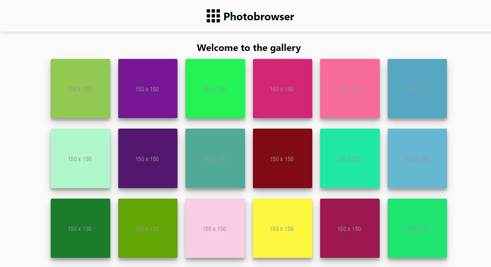

# Photobrowser App


## Project description
The goal of the app was to create a simple app that renders a grid of images and allows navigation from each image to a details page. The images used are from [JSONPlaceholder](http://jsonplaceholder.typicode.com/). No external image gallery packages or libraries were used.


## Demo
A live version of this app can be found at [photobrowsing.herokuapp.com](https://photobrowsing.herokuapp.com/)

## Technologies and tools
* React
* Styled Components
* Material UI
* Axios
* React Router
* React testing library (react & jest-dom)

This project was bootstrapped with [Create React App](https://github.com/facebook/create-react-app).

## Setup
* Clone this repository
* Install the dependencies with npm 
```
# Clone this repository
C:/> git clone 

# Navigate to the project folder
C:/> cd Photobrowser

# Install the dependencies
C:/> npm install
```

## Running the app locally
Run the start command in the root folder:
```
C:/> Photobrowser
C:/> npm start
```
Now you can open [localhost:3000](http://localhost:3000) to view the app in the browser.
## Running tests
Run all the tests in the root folder:
```
C:/> Photobrowser
C:/> npm run test
```
To run an individual test or set of tests run:
```
C:/> Photobrowser
C:/> npm run test -t 'name of test'
```

## Creating a production build
Creating a build is accomplished by running the following command:
```
C:/> Photobrowser
C:/> npm run build
```
## Author
Nina Weiler
